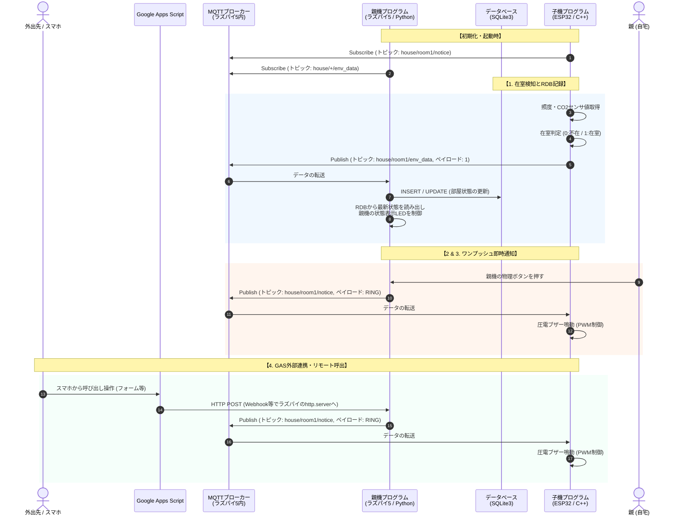

```mermaid
sequenceDiagram
    autonumber
    actor User as 外出先 / スマホ
    participant GAS as Google Apps Script
    participant Broker as MQTTブローカー<br/>(ラズパイ5内)
    participant Master as 親機プログラム<br/>(ラズパイ5 / Python)
    participant DB as データベース<br/>(SQLite3)
    participant Slave as 子機プログラム<br/>(ESP32 / C++)

    %% -----------------------------------------------------
    Note over Master, Slave: 【初期化・起動時】
    Slave->>Broker: Subscribe (トピック: house/room1/notice)
    Master->>Broker: Subscribe (トピック: house/+/env_data)

    %% -----------------------------------------------------
    Note over Slave, DB: 【1. 在室検知とRDB記録】
    rect rgb(240, 248, 255)
        Slave->>Slave: 照度・CO2センサ値取得
        Slave->>Slave: 在室判定 (0:不在 / 1:在室)
        Slave->>Broker: Publish (トピック: house/room1/env_data, ペイロード: 1)
        Broker->>Master: データの転送
        Master->>DB: INSERT / UPDATE (部屋状態の更新)
        Master->>Master: RDBから最新状態を読み出し<br/>親機の状態表示LEDを制御
    end

    %% -----------------------------------------------------
    Note over Master, Slave: 【2 & 3. ワンプッシュ即時通知】
    rect rgb(255, 245, 238)
        actor Parent as 親 (自宅)
        Parent->>Master: 親機の物理ボタンを押す
        Master->>Broker: Publish (トピック: house/room1/notice, ペイロード: RING)
        Broker->>Slave: データの転送
        Slave->>Slave: 圧電ブザー鳴動 (PWM制御)
    end

    %% -----------------------------------------------------
    Note over User, Slave: 【4. GAS外部連携・リモート呼出】
    rect rgb(245, 255, 250)
        User->>GAS: スマホから呼び出し操作 (フォーム等)
        GAS->>Master: HTTP POST (Webhook等でラズパイのhttp.serverへ)
        Master->>Broker: Publish (トピック: house/room1/notice, ペイロード: RING)
        Broker->>Slave: データの転送
        Slave->>Slave: 圧電ブザー鳴動 (PWM制御)
    end
```